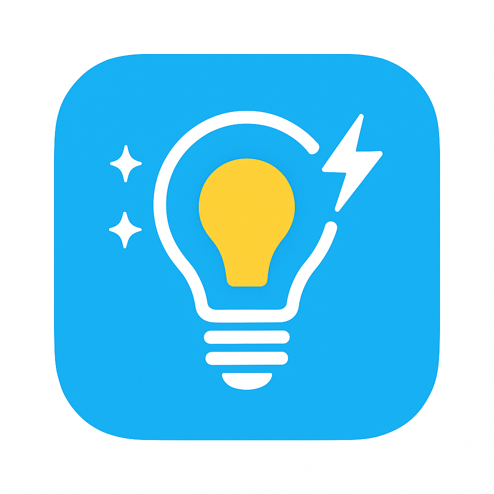

<p align="center">
  
</p>

# 🕯️ Simple Light Effects pour Home Assistant

[](https://github.com/hacs/integration)
[](https://github.com/votre_pseudo/ha-simple-light-effects)
[](https://www.home-assistant.io/)

Une intégration personnalisée (Custom Component) pour **Home Assistant** qui ajoute des effets d'éclairage dynamiques à **n'importe quelle lumière** (ampoules connectées, rubans LED, variateurs).

Contrairement aux effets natifs des ampoules (souvent limités), cette intégration utilise le moteur Python de Home Assistant pour calculer les variations, ce qui la rend compatible avec toutes les marques (Philips Hue, Tuya, Shelly, Zigbee, WiFi, etc.).

---

## ✨ Fonctionnalités
<!-- Simple Light Effects - README nettoyé -->

<p align="center">
  
</p>

# Simple Light Effects pour Home Assistant

Intégration personnalisée pour Home Assistant offrant des effets lumineux dynamiques (bougie, stroboscope, respiration, orage, battement de cœur, etc.). Compatible avec toute entité `light.` (Hue, Zigbee, Wi‑Fi, Shelly, Tuya, ...).

**Principales caractéristiques**

- Universel : fonctionne sur toute entité `light.`
- Asynchrone : n'empêche pas Home Assistant de fonctionner normalement
- Effets inclus : Bougie, Stroboscope, Alerte (police), Respiration, Orage, Battement de cœur
- Installation via HACS ou manuelle

---

## Installation

### Via HACS (recommandé)

1. Installer HACS si nécessaire (<https://hacs.xyz/>).
2. Ouvrir HACS → Intégrations → Dépôts personnalisés → ajouter l'URL de ce dépôt.
3. Installer l'intégration puis redémarrer Home Assistant.

### Installation manuelle

1. Copier le dossier `simple_light_effects` dans `config/custom_components/`.
2. Vérifier que `config/custom_components/simple_light_effects/__init__.py` existe.
3. Redémarrer Home Assistant.

---

## Configuration

Après redémarrage : Paramètres → Appareils et services → + Ajouter une intégration → Rechercher "Simple Light Effects". Aucune configuration YAML requise.

---

## Services disponibles (exemples)

Appelez ces services depuis vos automatisations, scripts ou la console de services.

- `simple_light_effects.candle` — Simule une flamme
  - `entity_id` (requis) : ex. `light.salon`
  - `brightness_scale` (optionnel, 1–100)

- `simple_light_effects.strobe` — Stroboscope
  - `entity_id` (requis)
  - `speed` (optionnel, secondes)

- `simple_light_effects.police` — Alerte (pulsation rapide)
  - `entity_id` (requis)

- `simple_light_effects.color_loop` — Respiration / transition douce
  - `entity_id` (requis)
  - `speed` (optionnel)

- `simple_light_effects.lightning` — Orage (flashes aléatoires)
  - `entity_id` (requis)

- `simple_light_effects.heartbeat` — Battement de cœur
  - `entity_id` (requis)

- `simple_light_effects.stop` — Arrête l'effet en cours
  - `entity_id` (requis)

Exemple d'appel de service (YAML) :

```yaml
service: simple_light_effects.candle
data:
  entity_id: light.salon
  brightness_scale: 60
```

---

## Exemples / Lovelace

Voici un exemple simple de boutons Lovelace (à adapter selon votre UI) :

```yaml
type: vertical-stack
cards:
  - type: entities
    entities:
      - entity: light.votre_lumiere

  - type: horizontal-stack
    cards:
      - type: button
        name: Bougie
        tap_action:
          action: call-service
          service: simple_light_effects.candle
          service_data:
            entity_id: light.votre_lumiere
            brightness_scale: 50

      - type: button
        name: Orage
        tap_action:
          action: call-service
          service: simple_light_effects.lightning
          service_data:
            entity_id: light.votre_lumiere

      - type: button
        name: STOP
        tap_action:
          action: call-service
          service: simple_light_effects.stop
          service_data:
            entity_id: light.votre_lumiere
```

---

## Automatisation : contrôleur universel (idée)

Vous pouvez créer des `input_select` et `input_number` pour choisir l'effet, la vitesse et l'intensité, puis lancer le service correspondant depuis une automatisation. Lisez la section "Tutoriel" dans l'ancienne README pour un exemple complet d'automatisation YAML.

---

## Support / Contribuer

- Problèmes (issues) : ouvrir une issue sur le dépôt GitHub
- Propositions de nouvelles animations : PRs bienvenues

---

## Merci

Si vous aimez ce projet, vous pouvez soutenir le développement (voir le dépôt pour le lien "Buy me a coffee").

---

*Fichier nettoyé et abrégé — document original conservé dans l'historique du dépôt.*

            data:
              entity_id: light.cuisine
      - conditions:
          - condition: state
            entity_id: input_select.mode_effet_cuisine
            state: "Coeur"
        sequence:
          - action: simple_light_effects.heartbeat
            data:
              entity_id: light.cuisine
      - conditions:
          - condition: state
            entity_id: input_select.mode_effet_cuisine
            state: "Néon"
        sequence:
          - action: simple_light_effects.neon
            data:
              entity_id: light.cuisine
      - conditions:
          - condition: state
            entity_id: input_select.mode_effet_cuisine
            state: "Phare"
        sequence:
          - action: simple_light_effects.lighthouse
            data:
              entity_id: light.cuisine
              speed: "{{ states('input_number.vitesse_effet') | float }}"
      - conditions:
          - condition: state
            entity_id: input_select.mode_effet_cuisine
            state: "SOS"
        sequence:
          - action: simple_light_effects.sos
            data:
              entity_id: light.cuisine
      - conditions:
          - condition: state
            entity_id: input_select.mode_effet_cuisine
            state: "Feu de camp"
        sequence:
          - action: simple_light_effects.campfire
            data:
              entity_id: light.cuisine

<a href="https://buymeacoffee.com/mickaelpila" target="_blank"></a>
